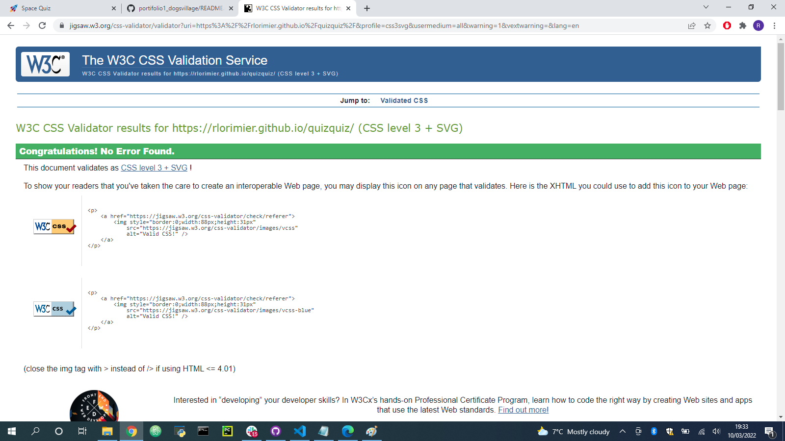
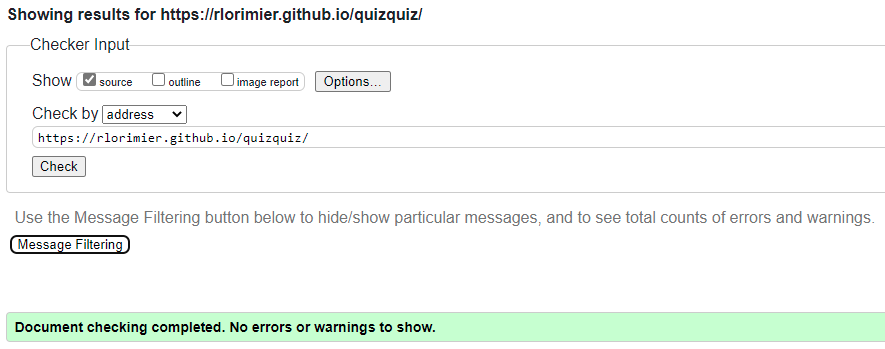

# Quiz Quiz

For my Second Project on Code Institute's Diploma in Software Developement course I have created a Quiz Game.

You can check out the game by clicking [HERE](https://rlorimier.github.io/quizquiz/)

I underestimated the JavaScript lessons and did not take them as serious as I should. For that reason my project is finalized but not exactly the way I have imagined when I started. I also did not use properly the tolls I have available for support (mentor, tutor, slack community) and for that I fully regret. I managed to finish this project working hard on the last day and I am not proud of that.

## Who is this for?
Everyone can enjoy!

## Features
### Existing code features
- Created in HTML5, CSS and JavaScript using Visual Studio Code.
- Add comments for an easy and clear code understanding. 

### Existing user features
- Before the game starts, user is presented with the game rules.
- Quiz is made of 10 questions with 3 choices each.
- All questions are related to space.
- After the user selects an answer the quiz is automatically redirected to the next question.
- If the user selects the correct answer the score is updated.
- At the end, user is presented with an option to restart the quiz.
### Features for future implementation
- Add a list with best scores and save it
- Add more questions
- Shuffled questions
## Technologies used
- HTML5
- CSS3
- JavaScript
- [GoogleFonts](https://fonts.google.com/) for fonts
- [Favicon](https://favicon.io/) for favicon
- [Google DevTools](https://developer.chrome.com/docs/devtools/) for responsiveness
- [Visual Studio Code](https://code.visualstudio.com/) as IDE
- [Git](https://git-scm.com/) for version control
- [GitHub](https://github.com/) to storage files and deployment of the website
- [TechSini](http://techsini.com/multi-mockup/index.php) multi device website mockup generator

## Resources
- [Code Institute](https://codeinstitute.net/) course materials and Slack community
- [W3schools](https://www.w3schools.com/)
- [Curso em Video](https://www.cursoemvideo.com/)
- [Udemy](https://www.udemy.com/course/curso-de-javascript-moderno-do-basico-ao-avancado/)

## Credits
### Content
- All questions were taken from several different websites.
### Coding
- The main code was taken from [This Website](https://edsonmaiap.wordpress.com/2021/09/25/curso-de-js-aula-20-aplicacoes-com-javascript-quiz-extensivel-e-com-placar/) and then edited as needed.
## Testing
### Browser Testing
The website buttons, links and functionality has been tested.
Tests has been carried out on Google Chrome, Microsoft Edge, Firefox, Internet Explorer and Samsung Internet.
#### Issue
*On Internet Explorer the website is not supported*
### Validators
- CSS: The website has been through Jigsaw Validator with [no errors/warnings](https://jigsaw.w3.org/css-validator/validator?uri=https%3A%2F%2Frlorimier.github.io%2Fquizquiz%2F&profile=css3svg&usermedium=all&warning=1&vextwarning=&lang=en) shown.

- HTML: The website has been through W3C HTML Validator with [no errors/warnings](https://validator.w3.org/nu/?showsource=yes&doc=https%3A%2F%2Frlorimier.github.io%2Fquizquiz%2F)

- JavaScript: Checked using Google DevTools and no errors/warnings were shown.

## Creating a Repository and Deploying
- The steps to create a new repository:
  1) Logged in my GitHub page, clicked in Repositories then New.
  2) Typed a name for the respository, selected Public and Add README file, then Create repository.
  3) On my GitHub Desktop, selected Add and then Clone a repository.
  4) On my Visual Studio Code (VSC), selected Open Folder and then selected the new created folder to start coding.

- The steps to commit and push commits:
  1) Every alteration on the files was being saved automatically.
  2) GitHub Desktop is connected with VSC and showns every changes made on the files.
  3) After every significant amount of coding is time for local commits:
     - On GitHub Desktop, type in a name for the commit and click Commit to Main.
  4) After a work day, the last local commit is done and then click in Push Origim to commit all local commits to GitHub repository.

- To Deploy:
  1) On GitHub website, select the repository and then click Settings.
  2) On the left side menu, click Pages.
  3) At Source, select the option Main and then Save.
  4) The page is reloaded and will show the link for your website. The link takes a few minutes to work properly.

